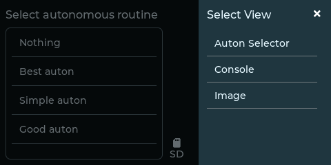

# robodash

Robodash is a GUI toolkit for the VEX V5 brain that provides GUI tools that
take better advantage of the brain's LCD display and a
system to improve compatibility with templates that provide LVGL-powered
GUIs.

Get started with robodash by reading
[the docs](https://unwieldycat.github.io/robodash/).

### Screenshots

Autonomous Selector Tool

View Selector

