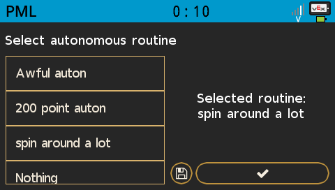

> ## ⚠️ Work in progress
> This project is a work in progress and is very unfinished. Do not depend on this library for competition purposes until a stable release is available.

# selectlib
A game-agnostic autonomous selector for the VEX V5 platform

<b>Preview</b>

### Features
- **Automatic selection** - loads previous selection from an SD card automatically
- **Customizable UI** - Easily change the color theme with one color value

## Installation

1. Download the latest template from the releases tab
2. Open download location and register the template by running `pros c fetch selectlib@x.x.x.zip`
3. Open the project you wish to use the library in and run `pros c apply selectlib@x.x.x`
