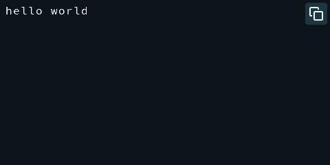
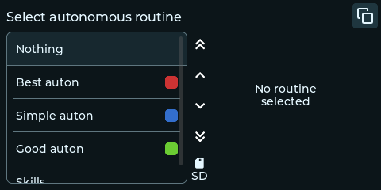
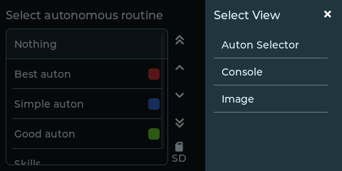

> [!IMPORTANT]
> ### Maintenance mode
> This project will not recieve further feature updates as I, the author of robodash,
> am no longer competing in the VEX V5RC competition and want to focus my energy elsewhere.
>
> Patches will be provided for an additional year, if there is a bug you need fixed do not
> hesitate to create an issue.

# robodash

Robodash is a GUI toolkit for the VEX V5 brain that provides GUI tools that
take better advantage of the brain's LCD display and a
system to improve compatibility with templates that provide LVGL-powered
GUIs.

Get started with robodash by reading
[the docs](https://robodash.readthedocs.io/en/latest/).

### Screenshots

Console Tool

Image Tool

Autonomous Selector Tool

View Selector

