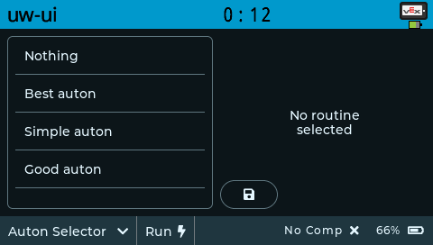

# unwieldy-ui

An elegant, modular, and powerful UI solution for VEX V5

Preview

### Features

- **Auton Selector** - An intuitive, game agnostic selector with SD card saving

- **Quick Actions** - Run user-defined functions from the toolbar

- **Customizable** - Customizable theme and splash screen

- **Plugable** - Create your own pages

## Installation

1. Download the latest template from the releases tab
2. Open download location and register the template by running
   `pros c fetch unwieldy-ui@x.x.x.zip`
3. Open the project you wish to use the library in and run
   `pros c apply unwieldy-ui@x.x.x`
4. `#include "unwieldy-ui/selector.hpp"` in your project's `main.h` file

See `main.cpp` for a usage example.
