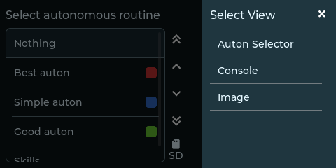
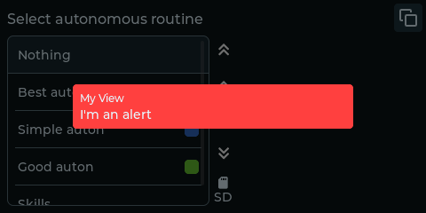
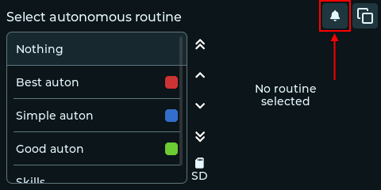

# User Interface

The user interface of robodash is designed to be minimally intrusive on the
content on screen. In the top right of the screen, no matter which view is
active, a button is present to open a pane to change the current view.

Upon opening the view switcher, a list of views are displayed on the right.
Tapping on any one of these will set them as the active view, and close the
switcher UI. If you do not wish to switch the active view, you can click the X
button or tap away.

## Alerts

Some views may encounter an error and request attention by sending an alert.
Alerts are placed front and center on screen.

Tapping the alert will dismiss the alert and focus the view that sent it.
Tapping away from the alert will hide the alert, where you can later view it by
clicking the bell icon to reopen the alert menu.

If multiple alerts appear, you can view the remaining ones in this menu as well.
The alert button will dissapear once all alerts are dismissed.
